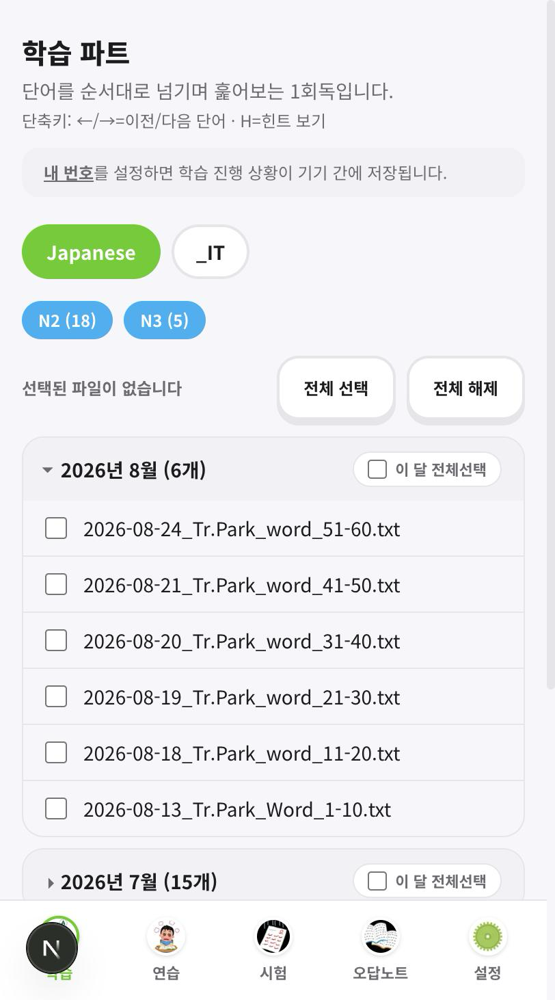
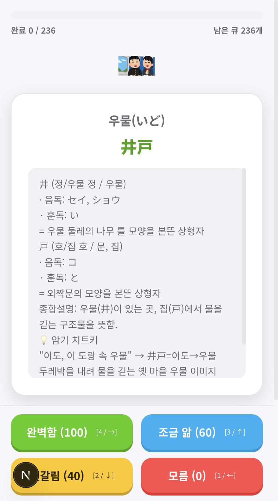
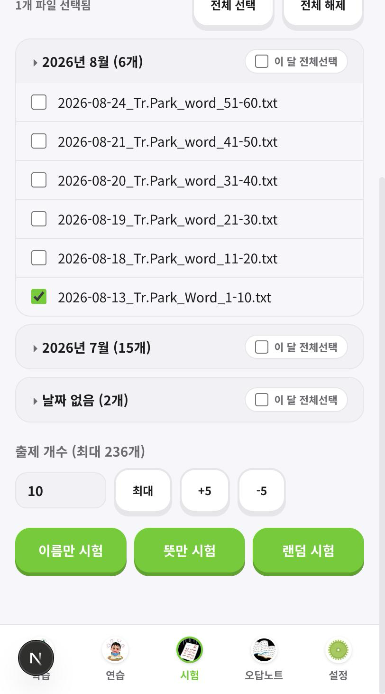
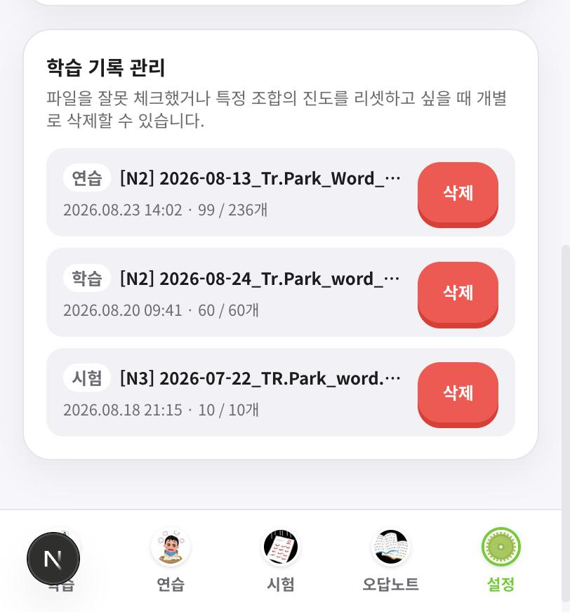

# 단어장 / 単語帳アプリ (word_app)

今すぐ試す / 바로 사용해보기: [https://wordapp-puce.vercel.app](https://wordapp-puce.vercel.app)


このリポジトリは[`word_test`](https://github.com/YSHHAN36565362/word_test)(Streamlit版・
プロトタイプ)の後継として作られた、Next.js + PWA版の単語帳アプリです。
このREADMEは上から日本語、その後に韓国語で同じ内容を記載しています。 /
이 README는 위에서부터 일본어, 그 아래에 같은 내용을 한국어로 다시 정리했습니다。

---

## 日本語

### 概要

K-Move 日本ITの研修同期が漢字暗記に苦労しているのを見て作った学習ツールです。
**GitHubリポジトリをそのまま単語帳データベースとして使用**し、進捗・誤答ノート・統計は
**Supabase**に保存することで、複数の端末で同じ「マイ番号」を使って続きから学習できます。

もともとは [`word_test`](https://github.com/YSHHAN36565362/word_test) という名前の
Streamlitアプリとして始まりました。機能はそのままに、実際のスマートフォンで毎日使い
やすいアプリのように感じられるよう、Next.js + PWAでフロントエンドを作り直したのが
このリポジトリ(`word_app`)です。

### 開発のきっかけ

K-Move 日本ITの研修過程で、多くの研修生が漢字の暗記に苦労していました。放課後に一緒に
復習をしていたとき、ある研修生が「同じ漢字を何度覚えても、翌日には忘れてしまう」と
漏らしたのが出発点です。

最初は単純な単語リストを作って共有しました。しかしすぐに限界が見えました。成り立ち
(語源)と例文がなければ結局記憶に残らないこと、そして一度覚えた単語をいつ再び見るべき
かを誰も管理できていないことです。そこで二つを自作しました。

1. LLMで漢字の成り立ち・例文・暗記のコツを生成し、単語帳を自動的に充実させる流れ
2. 自己評価に応じて再出現のタイミングが変わる忘却曲線キュー

Streamlit版(`word_test`)を2ヶ月以上毎日使ってみて、機能よりも「スマートフォンでどれ
だけ自然に使えるか」の方が大きな課題だと分かりました。Streamlitはリロードなしでカード
が裏返る感覚、下部タブナビゲーション、ホーム画面アイコンといったネイティブアプリの
感覚を構造的に出しにくく、セッションが頻繁に切れて進捗を失う問題もありました。そこで
データ構造と学習ロジックはそのまま移し、フロントエンドだけをNext.jsベースのPWAとして
作り直しました。その成果がこのリポジトリです。

| 項目 | 内容 |
|---|---|
| 開発時期 | 2026年 (K-Move 日本Java専門家育成課程受講中) |
| 種別 | 個人プロジェクト (実利用目的) |
| フレームワーク | Next.js (App Router) + TypeScript |
| 実行形態 | モバイルWebアプリ (PWA、ホーム画面インストール対応) |
| 単語帳データストア | GitHubリポジトリ (Contents API), [`word_test`](https://github.com/YSHHAN36565362/word_test) |
| 進捗データストア | Supabase (Postgres) |
| 旧バージョン | [`word_test`](https://github.com/YSHHAN36565362/word_test) — Streamlit版・プロトタイプ、同じデータ/ロジックを共有 |

---

### パート別機能

下部タブナビゲーションでパートを切り替えます。すべてのパートは画面上部で選んだ
ファイルの組み合わせをそのまま使用します。

| # | パート | 説明 |
|---|---|---|
| 1 | 学習 | 単語を順番にめくりながら一通り確認する1周モード。`←/→`で前後移動、`H`でヒント |
| 2 | 練習 | 忘却曲線キューを適用。自己評価(100/60/40/0)に応じて再出現のタイミングが変わり、単語ごとの習熟度がサーバーに永続保存される |
| 3 | 試験 | 出題数を指定してO/Xで採点。間違えた単語は自動で誤答ノートに保存 |
| 4 | 単語帳追加 | Web上で直接入力するかtxtをアップロードしてGitHubリポジトリにコミット |
| 5 | 文章暗記 | 会話文・読解文を一文ずつめくりながら暗唱 |
| 6 | 誤答ノート | 試験で間違えた単語を集めて確認し、その単語だけで練習をすぐに開始 |
| 7 | 統計 | 日別の練習・試験回数と正答率を確認 |
| 8 | お気に入り | 星印を付けた単語だけを集めて確認・再練習 |
| 9 | マッチングゲーム | 単語と意味のタイルを素早く揃えるミニゲーム。最速記録を保存 |
| 10 | 復習 | 完璧・少し分かると評価した単語だけを集めて再確認・再練習 |

#### 学習パート



大分類(Japanese / \_IT) → 詳細カテゴリ(N2, N3 …) → 月別アコーディオン → ファイルの
複数選択、と絞り込みます。複数ファイルを同時に選んで一つのリストに統合できます。


正解と併せて、漢字を部首単位に分解したヒントと、LLMが生成した暗記のコツが表示されます。
「単語の順番をシャッフル」ボタンで、同じ組み合わせを何度も繰り返し見るときに、内容
ではなく順番を覚えてしまうのを防げます。

#### 練習パート



正解確認後、完璧(100) ・ 少し分かる(60) ・ 曖昧(40) ・ 分からない(0) の4段階で自己
採点します。下部には進捗と残りキュー数がリアルタイムで更新されます。

#### 試験パート



選択したファイルの総単語数を上限として出題数を指定します。「最大」/「+5」/「-5」
ボタンで素早く調整できます。


#### 単語帳管理 (GitHub連携)


アプリ内で単語帳を作成し、そのままGitHubリポジトリへコミットします。直接入力と
txtアップロードの両方に対応し、ファイル名には本日の日付が自動で付きます。

---

### 核心 — 忘却曲線キューと永続的な習熟度

最も力を入れた部分です。よくある単語帳アプリは「正解 / 不正解」の二択ですが、実際の
暗記はそれほど二分法的ではありません。「見れば分かるが、すぐには出てこない」といった
中間状態が存在します。そこで自己評価を4段階に分け、それぞれキューのどの位置に再挿入
するかを変えて設計しました。

| 評価 | 点数 | 再挿入位置 | 意味 |
|---|---:|---|---|
| 完璧 | 100 | キューから除外(完了) | 今回のセッションでは再出題されない |
| 少し分かる | 60 | キューから除外(完了) | 今回のセッションでは再出題されない |
| 曖昧 | 40 | 残りキューの20–40%地点 | 中盤あたりで再登場 |
| 分からない | 0 | 残りキューの5–15%地点 | すぐに再登場 |

完璧・少し分かるの2段階は「今回はもう十分」として完了扱いにし、進捗率にもそのまま
反映されます(以前は完璧だけを完了として数えていたため、進捗率がなかなか上がらず
学習のモチベーションが下がるという声があり、少し分かるも完了に含めるよう変更しました)。

```ts
const REQUEUE_RANGES: Record<number, [number, number]> = {
  40: [0.2, 0.4],
  0: [0.05, 0.15],
};

export function requeuePosition(queueLen: number, level: 40 | 0): number {
  if (queueLen <= 1) return 0;
  const [lo, hi] = REQUEUE_RANGES[level];
  const loIdx = Math.max(0, Math.floor(queueLen * lo));
  const hiIdx = Math.max(loIdx, Math.floor(queueLen * hi));
  return loIdx + Math.floor(Math.random() * (hiIdx - loIdx + 1));
}
```

二つの設計意図があります。

- 固定値ではなく区間からランダムに選びます。位置を固定するとユーザーが順番を覚えて
  しまい、単語ではなく「順番」を記憶してしまいます。
- 絶対数ではなくキュー長に対する比率で計算します。残りが10語のときと300語のときで、
  「5〜15%後」の体感が自然に変わります。

Streamlit版ではこのキューが**セッション内でのみ**機能していたため、ブラウザを閉じると
それまでの採点結果が消えていました。word_appでは、採点するたびに単語ごとの最新スコアを
Supabaseの`word_mastery`テーブルに保存し、次に練習・試験を始めるときにこのスコアが低い
単語ほどキュー/出題の前方に来るよう並べ替えます。セッションが終わって日をまたいでも、
前回苦手だった単語が先に出てきます。

完璧・少し分かるで完了した単語は、その場では大丈夫でも時間が経つと忘れることがあります。
「その他 &gt; 復習」(設定画面からも移動可)で、これまで完璧/少し分かると評価した単語だけを
集めて改めて復習でき、また怪しくなった単語は個別に「初期化」して通常の連習で優先的に
出るよう戻せます。

### 学習ダッシュボードと再開機能


学習・練習画面の下部にサマリーカードがあります。

- 完了/残りの単語数を含む進捗率(`42% (99 / 236個完了、137個残り)`)
- 過去に学習したファイルの組み合わせを新しい順に見られるドロップダウン
- ドロップダウンで組み合わせを選び**[この学習をもう一度]**を押すと、そのときの
  ファイル選択とモード(名前のみ/意味のみ/ランダム)がそのまま復元され、自動で単語
  画面まで進む

ファイルの組み合わせごとの進捗記録は(ユーザー番号、パート、ファイルの組み合わせ)
単位で別途保存され、セッションが終わった後も最後の進捗率と学習時刻が残ります。

### 他の暗記アプリを参考にした機能

Anki・Quizlet・Duolingoなど代表的な暗記/語学アプリを調べ、word_appの構造に合う形で
3つの機能を追加しました。

- **連続学習日(ストリーク)** — Duolingoの「ストリーク」と同じ考え方です。学習・練習・
  試験・文章のいずれかを1日1回でも行うとその日が記録され、ホーム画面に「連続学習
  N日目」と表示されます。1日でも空くとストリークは途切れ、また1日目から始まります。
- **お気に入り(星印)単語** — Quizletの「starred terms」に相当します。学習・練習画面で
  単語横の星印(☆)を押すとサーバーに永続保存され、「その他 > お気に入り」で一覧
  確認・その単語だけで再練習ができます。誤答ノートと違い自動では溜まらず、自分で
  選んだ単語だけが入ります。
- **マッチングゲーム** — Quizletの「Match」ゲームに相当します。選んだファイルから
  ランダムに6組(タイル12枚)を出題し、単語と意味のタイルをできるだけ早く揃えます。
  完了タイムを計測し、その組み合わせでの自己ベストより速ければ新記録として保存
  されます。

---

### GitHubを単語帳データベースとして

個人用の学習ツールにDBサーバーを別途立てるのは過剰です。そこで**GitHub Contents API**
を単語帳のデータ層としてそのまま使いました。ただしトークンがブラウザに露出しては
いけないため、ブラウザはGitHub APIを直接呼び出さず、Next.jsサーバー(Route Handler)が
代わりに呼び出します。

| 機能 | 実装 |
|---|---|
| 単語帳一覧の取得 | `GET /contents/{path}` — フォルダ構成をそのままカテゴリとして使用、5分キャッシュ |
| 単語帳の読み込み | `GET` + base64デコード、5分キャッシュ |
| 単語帳の追加・更新 | `PUT /contents/{path}` — 既存ファイルは先にSHAを取得してから上書き |
| アップロードパスワードの検証 | サーバー側で定数時間比較により確認 |

この方式の利点は明確です。バージョン管理が無料で付いてきて(単語帳を誤って編集しても
コミット履歴から戻せる)、インフラ費用がゼロで、リポジトリをForkすれば仲間もそれぞれの
単語帳を持てます。

### Supabaseで進捗を同期 — 「マイ番号」

ログイン機能を付けると重くなります。代わりに、ユーザーが任意の数字を一つ入力すれば
それを識別子として進捗を保存する方式をそのまま引き継ぎました。番号を入力しなくても
学習自体は問題なく動作し、その場合は進捗のみが保存されません。

Streamlit版は進捗もGitHubコミットとして保存していましたが、word_appではこの部分を
**Supabase**に移しました。単語を1つめくるたびにGitHubへコミットすると、コミット履歴が
汚れて遅くなるためです。Supabaseは(ユーザー番号)単位でアクセスする無認証方式で、
既存アプリと同じ信頼モデルです(同じ授業を受ける少人数グループ内での利用を前提)。

| テーブル | 用途 |
|---|---|
| `progress` | 進行中のセッション1件 (パートごとに最新状態のみ保持) |
| `word_mastery` | 単語ごとの最新採点スコアと原文 (練習/試験共通、永続保存。「復習」機能にも使用) |
| `learning_log` | ファイルの組み合わせごとの進捗記録 — 完了後も残り、ダッシュボード/再開機能に使用 |
| `wrong_notes` | 誤答ノート |
| `study_stats` | 日別の学習統計 |
| `daily_activity` | 学習した日の記録(連続学習日/ストリーク計算用) |
| `favorites` | お気に入り(星印)単語 |
| `match_scores` | マッチングゲームのファイル組み合わせ別最速タイム |

単語をすばやく連続でめくると、保存リクエストが送信順とは違う順番でサーバーから
返ってくることがあり、遅れて届いた「古い」応答が直前の「最新」進捗を上書きしてしまう
不具合がありました。`progress`・`wrong_notes`テーブルへの書き込みは(ユーザー, パート)
ごとにキューで直列化し、常に呼び出した順番どおりに反映されるようにしています。

---

### 単語帳ファイルフォーマット

人が手で書きやすいことを最優先にしました。二つの形式の両方を許容し、パーサーが
自動で判別します。

形式A — コロン区切り

```
組み立てる : 조립하다(くみたてる)
- 組 (조/짤 조) = 糸(실)+且(쌓다) : 실을 쌓아 짜냄
- 立てる (たてる,세우다) : 세워서 만듦
종합설명: 부품들을 짜맞춰(組) 세워(立てる) 완성하는 것.
암기 치트키
1. "쿠미타테루=쿠(구) 미(니어카) 타(다) 조립한다"
2. 레고 블록을 짜맞춰 세우는 이미지
```

形式B — 行区切り

```
組み立てる
조립하다(くみたてる)
(3行目以降がヒント)
```

空行がブロックの区切りです。1行目に`:`があれば形式A、なければ形式Bとして処理し、
3行目以降はすべてヒントとしてまとめます。全角コロン(`：`)も半角に正規化し、
(単語、意味、ヒント)の3要素がすべて一致する項目は自動で重複排除します。

ヒント部分はLLMに生成させてそのまま貼り付ける前提で設計しています。

---

### はじめての方向けの使い方ガイド


「その他」メニューの一番上、「学習統計」より上に**「説明」**という専用タブがあります
(以前は設定画面の中に埋め込まれていましたが、独立したページに切り出しました)。
パート別の機能と便利機能(この学習をもう一度、単語の順番をシャッフル、学習記録の
管理、マイ番号、キーボードショートカット)をアコーディオンで開いて確認でき、それぞれ
実際の画面キャプチャも一緒に表示されるので、文章だけでは伝わりにくい部分も画像で
直感的に理解できます。初めて訪れた人もアプリを触る前に何ができるか先に確認できるように
しました。

### 学習記録の管理



設定画面で保存されている学習/練習/試験/文章の記録を一覧で確認し、不要な項目を個別に
削除できます。ファイルを誤って選択したり、特定の組み合わせの進捗を最初からやり直し
たいときに使います。

---

### 使いやすさのために入れたもの

実際に毎日使う道具なので、学習の流れが途切れる箇所を一つずつ潰すことに多くの時間を
使いました。

| 機能 | 理由 |
|---|---|
| キーボードショートカット (`←/→`, `H`, `Space`, `1`~`4`) | マウスでボタンを探す時間が暗記のリズムを途切れさせます |
| 単語の順番をシャッフル | 同じ組み合わせを繰り返し見ると、内容ではなく順番を覚えてしまうことがあります |
| 学習ダッシュボード + この学習をもう一度 | 以前のファイル組み合わせ/モードを再度探してチェックする手間をなくします |
| PWAインストール + 下部タブナビゲーション | ホーム画面に追加するとアドレスバーなしでアプリのように起動します |
| 3DフリップカードUI + マスコットのリアクション | 採点のたびに画面全体が再描画されず、カードが裏返りながら反応します |
| 集中モード (Focus mode) | 学習が始まると下部ナビゲーションを畳んで画面を広く使います |
| ダークモード / ライトモード | 夜間のスマートフォン画面の明るさ負担を減らします |
| JLPT D-dayカウントダウン | ホーム画面で試験日までの残り日数をすぐ確認できます |
| 全画面共通のページヘッダー(色付きバッジ + タイトル) | 画面ごとにバラバラだった見出しを統一し、パートを一目で識別できるようにします |
| タブ切り替え時のフェードイン遷移 | 画面が急に切り替わるのではなく、自然につながる感覚を出します |
| 採点直後の画面フラッシュ | 正解/不正解のたびに画面全体を緑/赤で一瞬照らし、Duolingoのような即座のフィードバックを与えます |
| 完了画面の紙吹雪演出 | 学習・練習・試験・マッチングゲームを終えるたびに紙吹雪が飛び散り、達成感を強調します |
| 連続学習日バッジの炎アイコン | 常にゆらゆら揺れるアニメーションで、ホーム画面のストリーク表示を目立たせます |

---

### フォルダ構成

```
src/
  app/
    study/ practice/ exam/ wrongnotes/ favorites/ match/ stats/ script/ wordbook/  # 各パートのページ
    more/                        # その他メニュー
      guide/                     # 使い方説明(パート別/便利機能をスクリーンショット付きで案内)
      review/                    # 復習(完璧・少し分かると評価した単語だけを再確認)
      settings/                  # 設定(マイ番号・テーマ・学習記録管理)
    api/
      config/                    # ブラウザにSupabaseのURL/anon keyを渡す
      wordlist/tree/             # word_listフォルダのツリー (カテゴリ > 詳細カテゴリ > ファイル)
      wordlist/words/            # 選択したファイルの単語プールをパース (POST)
      wordlist/script/           # 文章暗記用の行単位パース
      wordbook/                  # 単語帳追加 (GitHubコミット、パスワード検証)
  components/                    # FileSelector, FlashCard(3Dフリップ), Mascot, SessionInfoPanel, UsageGuide, PageHeader, PageTransition, Confetti, FeedbackFlash, StreakFlame など
  contexts/                      # ThemeContext(ダークモード), FocusModeContext(集中モード)
  lib/                           # parser, queue(忘却曲線), mastery(習熟度), learningLog(ダッシュボード), streak(連続学習日), favorites(お気に入り), matchScores(マッチングゲーム記録), github(サーバー専用), supabase
  hooks/useUserId.ts             # localStorage + URLクエリ(?uid=)ベースの「マイ番号」
supabase/schema.sql              # progress / word_mastery / learning_log / daily_activity / favorites / match_scores / wrong_notes / study_stats テーブル + RLS
scripts/generate-icons.mjs       # PWAアイコン(PNG)生成スクリプト
public/images/                   # 下部ナビアイコン + 練習/学習フィードバックキャラクター画像
images/                          # README用スクリーンショット
```

---

### 実行方法

```bash
npm install
cp .env.example .env.local   # 下記の「環境変数」を参考に値を入力
npm run dev
```

`GITHUB_TOKEN`がなくても(公開リポジトリのため)単語帳の読み込みはできますが、1時間
あたりのリクエスト上限が60回と低く、アクセスが多いとすぐに枯渇します。トークンの
設定を推奨します。

#### 環境変数

`.env.example`を参照してください。デプロイ時はVercelプロジェクト設定のEnvironment
Variablesに以下を登録します。

| 変数 | 用途 | 必須 |
|---|---|---|
| `GITHUB_OWNER`, `GITHUB_REPO`, `GITHUB_BRANCH` | 単語帳があるリポジトリ (`YSHHAN36565362/word_test`, `main`) | 必須 |
| `GITHUB_TOKEN` | 単語帳追加(書き込み) + 読み込み上限の引き上げ。repoにContents: Read and write権限を持つFine-grained PAT | 書き込み機能に必須 |
| `UPLOAD_PASSWORD` | 単語帳追加時に確認するパスワード | 書き込み機能に必須 |
| `NEXT_PUBLIC_SUPABASE_URL`, `NEXT_PUBLIC_SUPABASE_ANON_KEY` | 進捗/誤答ノート/統計の同期 | 同期機能に必須 (Vercel Supabase Integrationが`STORAGE_`接頭辞で保存している場合はそのままでも`/api/config`が代わりに読み込みます) |

Supabaseなしでデプロイしてもアプリは正常に動作し、その場合は「マイ番号」を入力しても
進捗が保存されない旨の案内のみ表示されます。

#### Supabase設定 (端末間の進捗同期)

1. [supabase.com](https://supabase.com)で新規プロジェクトを作成 (無料プランで十分)。
2. プロジェクトのSQL Editorで`supabase/schema.sql`ファイル全体を貼り付けて実行。
3. Project Settings → APIで`Project URL`と`anon public`キーをコピーし、
   `NEXT_PUBLIC_SUPABASE_URL`, `NEXT_PUBLIC_SUPABASE_ANON_KEY`に設定。

このスキーマは実際のログインなしに「マイ番号」文字列だけでアクセスする方式のため、
厳密なセキュリティではありません(既存Streamlitアプリの「マイ番号」保存方式と同水準)。
同じ授業を受ける30人未満の信頼グループ内での利用を前提としています。

#### GitHubトークンの発行 (単語帳追加用)

1. GitHub → Settings → Developer settings → Fine-grained tokens → Generate new token。
2. Repository accessを`word_test`リポジトリに限定。
3. Permissions → Contents: Read and write。
4. 発行されたトークンを`GITHUB_TOKEN`に設定。

#### Vercelデプロイ

1. このフォルダ(`word_app`)を新しいGitHubリポジトリへpush。
2. [vercel.com](https://vercel.com) → New Project → 作成したリポジトリを選択
   (Next.jsを自動認識)。
3. Environment Variablesに上表の値を入力してDeploy。
4. デプロイされたURLにアクセス → モバイルブラウザで「ホーム画面に追加」すると
   PWAとしてインストールされ、アドレスバーなしで全画面アプリのように起動します。

---

### 旧Streamlit版(word_test)との違い

- リロードなしでカードが3Dで裏返り(Framer Motion)、採点時にマスコットが反応します。
- 下部タブナビゲーション + PWAで、実際のモバイルアプリのようにホーム画面にインストール
  できます。
- 進捗保存がGitHubコミットからSupabaseに変わり、はるかに高速でコミット履歴も汚れません。
- 単語ごとの採点スコア(習熟度)がセッションを超えて永続保存され、次回の練習・試験でも
  苦手だった単語が先に出てきます — Streamlit版ではセッション内でのみ機能していた部分です。
- ファイルの組み合わせごとの進捗記録が残り、学習ダッシュボード(進捗率、最終学習時刻、
  過去記録のドロップダウン、この学習をもう一度)から確認・再利用できます。
- 学習・練習・試験中いつでも「単語の順番をシャッフル」で順番暗記を防げます。
- 「その他」メニューに、初めての方向けの使い方ガイド(画面キャプチャ付き)専用ページと、
  保存された学習記録を個別に削除できる管理UIがあります。
- すべての画面で共通のページヘッダー(色付きバッジ)とタブ切り替え時のフェードイン
  遷移を導入し、画面ごとの見た目のばらつきをなくしました。
- 「フローティングメモ」「セッションkeep-alive」などStreamlit iframe特有の回避策は
  不要になったため移植していません。

### 学んだこと

- 最良の要件定義は、自分が味わった不便である。セッションが切れて最初からやり直し、
  進捗が端末ごとにバラバラで、同じ順番を繰り返すうちに単語ではなく順番を覚えてしまう
  — 機能リストの多くは実際にイライラした瞬間から生まれました。
- 正解/不正解の二択では暗記の実態を捉えられない。4段階の自己評価と比率ベースの
  再挿入に変えて初めて、「曖昧に覚えている単語」が適切な間隔で戻ってくるようになり
  ました。
- インフラを増やさずに問題を解く方法がある。DBを立てる代わりにGitHub APIを単語帳の
  データ層に、Supabaseを進捗のデータ層に分けて使った選択は、個人プロジェクトの制約
  (費用・運用負担)の中でバージョン管理まで手に入れる結果につながりました。
- フレームワークを変えることと機能を再設計することは別の作業である。Streamlitから
  Next.jsへ移行しつつも、忘却曲線キュー・ファイルフォーマット・GitHubデータ構造は
  そのまま引き継ぎ、フロントエンドの実際に触れる部分(カード遷移、下部タブ、
  ダッシュボード)だけを作り直しました。

### 今後の改善

- 試験パートにも学習ダッシュボード(進捗率/再開機能)を適用することを検討中です。
  現在は学習・練習パートのみにあります。
- ヒント生成のLLM呼び出しをアプリ内に直接統合(現在は外部で生成してから貼り付け)。
- 学習統計ダッシュボードを日別の学習量だけでなく、パート・カテゴリ別にも細分化。
- オフラインでもすでに取得済みの単語帳で学習できるようService Workerのキャッシュを
  強化。

### 技術スタック

`Next.js (App Router)` · `TypeScript` · `Tailwind CSS` · `Framer Motion` · `Anime.js` ·
`Supabase (Postgres)` · `GitHub Contents API` · `PWA`

---

## 한국어

### 개요

K-Move 일본 IT 연수 동기들이 한자 암기에 어려움을 겪는 것을 보고 만든 학습 도구입니다.
**GitHub 저장소를 단어장 데이터베이스로 그대로 사용**하고, 진행 상황·오답 노트·통계는
**Supabase**에 저장해 여러 기기에서 같은 "내 번호"로 이어서 쓸 수 있습니다.

원래는 [`word_test`](https://github.com/YSHHAN36565362/word_test) 라는 이름의 Streamlit
앱으로 시작했습니다. 기능은 그대로 두고, 실제 휴대폰에서 매일 쓰기 편한 앱처럼 느껴지도록
Next.js + PWA로 프론트엔드를 다시 만든 것이 이 저장소(`word_app`)입니다.

### 만들게 된 계기

K-Move 일본 IT 연수 과정에서 많은 연수생이 한자 암기에 어려움을 겪고 있었습니다. 방과 후
함께 복습을 하던 중 한 연수생이 "같은 한자를 몇 번을 외워도 다음 날이면 잊어버린다"고
말한 것이 시작이었습니다.

처음에는 단순한 단어 리스트를 만들어 공유했습니다. 그런데 금방 한계가 보였습니다.
성립(어원)과 예문이 없으면 결국 기억에 남지 않는다는 것, 그리고 한 번 외운 단어를 언제
다시 봐야 하는지를 아무도 관리하지 못한다는 것이었습니다. 그래서 두 가지를 직접
만들었습니다.

1. LLM으로 한자의 성립·예문·암기 치트키를 생성해 단어장을 자동으로 채우는 흐름
2. 자기 평가에 따라 다시 등장하는 시점이 달라지는 망각 곡선 큐

Streamlit 버전(`word_test`)으로 두 달 넘게 매일 써보니, 기능보다 "휴대폰에서 얼마나
자연스럽게 쓰이는가"가 더 큰 문제였습니다. Streamlit은 새로고침 없이 카드가 뒤집히는
느낌, 하단 탭 내비게이션, 홈 화면 아이콘 같은 네이티브 앱 감각을 구조적으로 내기 어려웠고,
세션이 자주 끊겨 진행 상황을 잃는 문제도 있었습니다. 그래서 데이터 구조와 학습 로직은
그대로 옮기고, 프론트엔드만 Next.js 기반 PWA로 다시 만들었습니다. 그 결과물이 이
저장소입니다.

| 항목 | 내용 |
|---|---|
| 개발 시기 | 2026년 (K-Move 일본 Java 전문가 육성과정 수강 중) |
| 유형 | 개인 프로젝트 (실사용 목적) |
| 프레임워크 | Next.js (App Router) + TypeScript |
| 실행 형태 | 모바일 웹앱 (PWA, 홈 화면 설치 지원) |
| 단어장 데이터 저장소 | GitHub 저장소 (Contents API), [`word_test`](https://github.com/YSHHAN36565362/word_test) |
| 진행 상황 저장소 | Supabase (Postgres) |
| 이전 버전 | [`word_test`](https://github.com/YSHHAN36565362/word_test) — Streamlit 버전 · 프로토타입, 같은 데이터/로직을 공유 |

---

### 파트별 기능

하단 탭 내비게이션으로 파트를 전환합니다. 모든 파트는 화면 상단에서 고른 파일 조합을
그대로 사용합니다.

| # | 파트 | 설명 |
|---|---|---|
| 1 | 학습 | 단어를 순서대로 넘기며 훑어보는 1회독 모드. `←/→`로 이전/다음, `H`로 힌트 |
| 2 | 연습 | 망각 곡선 큐 적용. 자기 평가(100/60/40/0)에 따라 재등장 시점이 달라지고, 단어별 숙련도가 서버에 영구 저장됨 |
| 3 | 시험 | 출제 개수를 지정해 O/X로 채점. 틀린 단어는 오답 노트에 자동 저장 |
| 4 | 단어장 추가 | 웹에서 직접 입력하거나 txt를 올려 GitHub 저장소에 커밋 |
| 5 | 지문 암기 | 회화문·독해 지문을 한 문장씩 넘기며 암송 |
| 6 | 오답 노트 | 시험에서 틀린 단어를 모아보고, 그 단어들로 바로 연습을 시작 |
| 7 | 통계 | 날짜별 연습·시험 횟수와 정답률 확인 |
| 8 | 즐겨찾기 | 별표 표시한 단어만 모아 확인·재연습 |
| 9 | 매칭 게임 | 단어-뜻 타일을 빠르게 짝맞추는 미니 게임. 최고 기록 저장 |
| 10 | 복습 | 완벽함·조금 앎으로 채점한 단어만 모아 다시 확인·재연습 |

#### 학습 파트


대분류(Japanese / \_IT) → 세부 카테고리(N2, N3 …) → 월별 아코디언 → 파일 다중 선택
순으로 좁혀 들어갑니다. 여러 파일을 동시에 골라 하나의 목록으로 합칠 수 있습니다.


정답과 함께 한자를 부수 단위로 분해한 힌트와 LLM이 생성한 암기 치트키가 표시됩니다.
"단어 순서 섞기" 버튼으로, 같은 조합을 여러 번 반복해서 볼 때 내용이 아니라 순서를
외워버리는 것을 막을 수 있습니다.

#### 연습 파트


정답 확인 후 완벽함(100) · 조금 앎(60) · 헷갈림(40) · 모름(0) 4단계로 스스로 채점합니다.
하단에는 진행률과 남은 큐 개수가 실시간으로 갱신됩니다.

#### 시험 파트


선택한 파일들의 전체 단어 수를 상한으로 출제 개수를 지정합니다. `최대` / `+5` / `-5`
버튼으로 빠르게 조절할 수 있습니다.


#### 단어장 관리 (GitHub 연동)


앱 안에서 바로 단어장을 만들어 GitHub 저장소에 커밋합니다. 직접 입력 방식과 txt 업로드
방식을 모두 지원하며, 파일 제목에는 오늘 날짜가 자동으로 붙습니다.

---

### 핵심 — 망각 곡선 큐와 영구 숙련도

가장 공을 들인 부분입니다. 흔한 단어장 앱은 「맞음 / 틀림」 2지선다지만, 실제 암기는
그렇게 이분법적이지 않습니다. "보면 알겠는데 바로는 안 나온다" 같은 중간 상태가
존재합니다. 그래서 자기 평가를 4단계로 나누고, 각 단계마다 큐의 어느 위치에 다시
꽂아 넣을지를 다르게 설계했습니다.

| 평가 | 점수 | 재삽입 위치 | 의미 |
|---|---:|---|---|
| 완벽함 | 100 | 큐에서 제거(완료) | 이번 세션에서 다시 안 나옴 |
| 조금 앎 | 60 | 큐에서 제거(완료) | 이번 세션에서 다시 안 나옴 |
| 헷갈림 | 40 | 남은 큐의 20–40% 지점 | 중간쯤에 다시 |
| 모름 | 0 | 남은 큐의 5–15% 지점 | 곧바로 다시 |

완벽함·조금 앎 2단계는 "이번엔 충분히 안 것"으로 보고 완료 처리하며, 진행률에도 그대로
반영됩니다(예전에는 완벽함만 완료로 쳐서 진행률이 잘 안 올라가고 학습 의욕이 떨어진다는
의견이 있어, 조금 앎도 완료에 포함하도록 바꿨습니다).

```ts
const REQUEUE_RANGES: Record<number, [number, number]> = {
  40: [0.2, 0.4],
  0: [0.05, 0.15],
};

export function requeuePosition(queueLen: number, level: 40 | 0): number {
  if (queueLen <= 1) return 0;
  const [lo, hi] = REQUEUE_RANGES[level];
  const loIdx = Math.max(0, Math.floor(queueLen * lo));
  const hiIdx = Math.max(loIdx, Math.floor(queueLen * hi));
  return loIdx + Math.floor(Math.random() * (hiIdx - loIdx + 1));
}
```

두 가지 설계 의도가 있습니다.

- 고정값이 아니라 구간에서 무작위로 뽑습니다. 위치를 고정하면 사용자가 순서를
  외워버려서, 단어가 아니라 "순서"를 기억하게 됩니다.
- 절대 개수가 아니라 큐 길이의 비율로 계산합니다. 남은 단어가 10개일 때와 300개일
  때 "5~15% 뒤"의 체감이 자연스럽게 달라집니다.

Streamlit 버전에서는 이 큐가 **세션 안에서만** 동작해서, 브라우저를 닫으면 그동안의
채점 결과가 사라졌습니다. word_app에서는 채점할 때마다 단어별 최신 점수를 Supabase
`word_mastery` 테이블에 저장하고, 다음에 연습·시험을 다시 시작할 때 이 점수가 낮은
단어일수록 큐/출제 앞쪽에 오도록 정렬합니다. 세션이 끝나고 하루가 지나도, 지난번에
약했던 단어가 먼저 나옵니다.

완벽함·조금 앎으로 완료한 단어도 시간이 지나면 잊어버릴 수 있습니다. "더보기 &gt; 복습"
(설정 화면에서도 이동 가능)에서 지금까지 완벽함/조금 앎으로 채점한 단어만 모아 다시
연습할 수 있고, 다시 헷갈리는 단어는 개별로 "초기화"해서 평소 연습에서 다시 우선
출제되도록 되돌릴 수 있습니다.

### 학습 대시보드와 이어하기


학습·연습 화면 하단에는 요약 카드가 있습니다.

- 완료/남은 단어 개수를 포함한 진행률(`42% (99 / 236개 완료, 137개 남음)`)
- 예전에 공부했던 파일 조합들을 최근 순으로 볼 수 있는 드롭다운
- 드롭다운에서 조합을 고르고 **[이 학습 다시 하기]**를 누르면, 그때 썼던 파일 선택과
  모드(이름만/뜻만/랜덤)가 그대로 복원되면서 자동으로 단어 화면까지 진입

파일 조합별 진행 기록은 (사용자 번호, 파트, 파일 조합) 단위로 별도 저장되어, 세션이
끝난 뒤에도 마지막 진행률과 학습 시각이 남습니다.

### 다른 암기 앱을 참고해 추가한 기능

Anki·Quizlet·Duolingo 같은 대표적인 암기/어학 앱들을 조사해서, word_app 구조에 맞는
형태로 세 가지 기능을 추가했습니다.

- **연속 학습일(스트릭)** — Duolingo의 "스트릭"과 같은 개념입니다. 학습/연습/시험/
  지문 중 무엇이든 하루에 한 번만 해도 그 날짜가 기록되고, 홈 화면에 "연속 학습
  N일째"로 표시됩니다. 하루라도 건너뛰면 스트릭이 끊기고 다시 1일부터 시작합니다.
- **즐겨찾기(별표) 단어** — Quizlet의 "starred terms"에 해당합니다. 학습·연습 화면에서
  단어 옆 별표(☆)를 누르면 서버에 영구 저장되고, "더보기 &gt; 즐겨찾기"에서 목록
  확인·그 단어들로만 재연습을 할 수 있습니다. 오답 노트와 달리 자동으로 쌓이지 않고
  직접 고른 단어만 들어갑니다.
- **매칭 게임** — Quizlet의 "Match" 게임에 해당합니다. 선택한 파일에서 무작위로 6쌍
  (타일 12개)을 출제해, 단어와 뜻 타일을 최대한 빨리 짝짓습니다. 완료 시간을 측정해
  그 조합의 기존 최고 기록보다 빠르면 새 기록으로 저장합니다.

---

### GitHub을 단어장 데이터베이스로

개인 학습 도구에 DB 서버를 따로 띄우는 것은 과합니다. 그래서 **GitHub Contents API**를
단어장 데이터 계층으로 그대로 사용했습니다. 다만 토큰이 브라우저에 노출되면 안 되므로,
브라우저는 GitHub API를 직접 호출하지 않고 Next.js 서버(Route Handler)가 대신
호출합니다.

| 기능 | 구현 |
|---|---|
| 단어장 목록 조회 | `GET /contents/{path}` — 폴더 구조를 그대로 카테고리로 사용, 5분 캐시 |
| 단어장 읽기 | `GET` + base64 디코드, 5분 캐시 |
| 단어장 추가·수정 | `PUT /contents/{path}` — 기존 파일은 SHA를 먼저 조회해 덮어쓰기 |
| 업로드 비밀번호 검증 | 서버에서 상수시간 비교로 확인 |

이 방식의 장점은 명확합니다. 버전 관리가 공짜로 따라오고(단어장을 잘못 고쳐도 커밋
히스토리로 되돌릴 수 있음), 인프라 비용이 0원이며, 저장소를 Fork 하면 동료들도 각자의
단어장을 가질 수 있습니다.

### Supabase로 진행 상황 동기화 — "내 번호"

로그인 기능을 붙이면 무거워집니다. 대신 사용자가 원하는 숫자를 하나 입력하면 그것을
식별자로 삼아 진행 상황을 저장하는 방식을 그대로 이어받았습니다. 번호를 입력하지
않아도 학습 자체는 문제없이 동작하고, 이 경우 진행 상황만 저장되지 않습니다.

Streamlit 버전은 진행 상황도 GitHub 커밋으로 저장했지만, word_app에서는 이 부분을
**Supabase**로 옮겼습니다. 학습 한 단어 넘길 때마다 GitHub에 커밋하면 커밋 히스토리가
지저분해지고 느리기 때문입니다. Supabase는 (사용자 번호) 단위로 접근하는 무-인증
방식으로, 기존 앱과 동일한 신뢰 모델입니다(같은 수업을 듣는 소규모 그룹 안에서 쓰는
것을 전제).

| 테이블 | 용도 |
|---|---|
| `progress` | 진행 중인 세션 1개 (파트별로 최신 상태만 유지) |
| `word_mastery` | 단어별 최신 채점 점수와 원문 (연습/시험 공통, 영구 보관. "복습" 기능에도 사용) |
| `learning_log` | 파일 조합별 진행 기록 — 완료 후에도 남아서 대시보드/이어하기에 사용 |
| `wrong_notes` | 오답 노트 |
| `study_stats` | 날짜별 학습 통계 |
| `daily_activity` | 학습한 날짜 기록 (연속 학습일/스트릭 계산용) |
| `favorites` | 즐겨찾기(별표) 단어 |
| `match_scores` | 매칭 게임의 파일 조합별 최고 기록 |

단어를 빠르게 연달아 넘기면 저장 요청이 보낸 순서와 다르게 서버에서 응답이 와서,
늦게 도착한 "오래된" 응답이 방금 저장된 "최신" 진행 상황을 덮어써버리는 버그가
있었습니다. `progress`·`wrong_notes` 테이블에 쓰는 작업은 (사용자, 파트)별로
큐에 줄 세워 항상 호출한 순서대로 반영되도록 고쳤습니다.

---

### 단어장 파일 포맷

사람이 손으로 쓰기 쉬운 것을 최우선으로 했습니다. 두 가지 형식을 모두 허용하며,
파서가 자동으로 판별합니다.

형식 A — 콜론 구분

```
組み立てる : 조립하다(くみたてる)
- 組 (조/짤 조) = 糸(실)+且(쌓다) : 실을 쌓아 짜냄
- 立てる (たてる,세우다) : 세워서 만듦
종합설명: 부품들을 짜맞춰(組) 세워(立てる) 완성하는 것.
암기 치트키
1. "쿠미타테루=쿠(구) 미(니어카) 타(다) 조립한다"
2. 레고 블록을 짜맞춰 세우는 이미지
```

형식 B — 줄 구분

```
組み立てる
조립하다(くみたてる)
(3번째 줄부터 힌트)
```

빈 줄이 블록 구분자입니다. 첫 줄에 `:`가 있으면 A형식, 없으면 B형식으로 처리하고,
3번째 줄부터는 전부 힌트로 묶습니다. 전각 콜론(`：`)도 반각으로 정규화하고,
(단어, 뜻, 힌트) 3요소가 모두 같은 항목은 자동으로 중복 제거합니다.

힌트 부분은 LLM에게 생성시킨 뒤 그대로 붙여 넣는 것을 전제로 설계했습니다.

---

### 처음 쓰는 사람을 위한 사용법 안내


"더보기" 메뉴 맨 위, "학습 통계"보다 위에 **"설명"**이라는 전용 탭이 있습니다(예전에는
설정 화면 안에 들어있었지만, 독립된 페이지로 분리했습니다). 파트별 기능과 편의
기능(이 학습 다시 하기, 단어 순서 섞기, 학습 기록 관리, 내 번호, 키보드 단축키)을
아코디언으로 펼쳐 볼 수 있고, 각 항목마다 실제 화면 캡처도 함께 보여줘서 글로만
설명하기 어려운 부분도 이미지로 직관적으로 이해할 수 있습니다. 처음 방문한 사람도
앱을 둘러보기 전에 무엇을 할 수 있는지 먼저 확인할 수 있게 했습니다.

### 학습 기록 관리


설정 화면에서 저장된 학습/연습/시험/지문 기록을 목록으로 확인하고, 필요 없는 항목을
개별로 삭제할 수 있습니다. 파일을 잘못 선택했거나 특정 조합의 진도를 처음부터 다시
재고 싶을 때 사용합니다.

---

### 사용성을 위해 넣은 것들

실제로 매일 쓰는 도구이다 보니, 학습 흐름이 끊기는 지점을 하나씩 없애는 데 시간을
많이 썼습니다.

| 기능 | 이유 |
|---|---|
| 키보드 단축키 (`←/→`, `H`, `Space`, `1`~`4`) | 마우스로 버튼을 찾는 시간이 암기 리듬을 끊습니다 |
| 단어 순서 섞기 | 같은 조합을 반복해서 보면 내용이 아니라 순서를 외워버릴 수 있습니다 |
| 학습 대시보드 + 이 학습 다시 하기 | 예전 파일 조합/모드를 다시 찾아 체크하는 수고를 없앱니다 |
| PWA 설치 + 하단 탭 내비게이션 | 홈 화면에 추가하면 주소창 없이 앱처럼 실행됩니다 |
| 3D 플립 카드 + 마스코트 반응 | 채점할 때마다 화면이 다시 그려지지 않고 카드가 뒤집히며 반응합니다 |
| 집중 모드 (Focus mode) | 학습이 시작되면 하단 내비게이션을 접어 화면을 비웁니다 |
| 다크 모드 / 라이트 모드 | 밤에 스마트폰 화면 밝기 부담을 줄입니다 |
| JLPT D-day 카운트다운 | 홈 화면에서 시험일까지 남은 날짜를 바로 확인합니다 |
| 전 화면 공통 페이지 헤더 (색 배지 + 제목) | 화면마다 제각각이던 제목 영역을 통일해 지금 어떤 파트인지 한눈에 알 수 있게 합니다 |
| 탭 전환 시 페이드인 전환 효과 | 화면이 뚝뚝 끊기지 않고 자연스럽게 이어지는 느낌을 줍니다 |
| 채점 직후 화면 플래시 | 정답/오답마다 화면 전체를 초록/빨강으로 잠깐 비춰, Duolingo처럼 즉각적인 피드백을 줍니다 |
| 완료 화면 색종이(컨페티) 연출 | 학습·연습·시험·매칭 게임을 끝낼 때마다 색종이가 터지며 성취감을 강조합니다 |
| 연속 학습일 배지의 불꽃 아이콘 | 계속 일렁이는 애니메이션으로 홈 화면의 스트릭 표시를 눈에 띄게 합니다 |

---

### 폴더 구조

```
src/
  app/
    study/ practice/ exam/ wrongnotes/ favorites/ match/ stats/ script/ wordbook/  # 각 파트 페이지
    more/                        # 더보기 메뉴
      guide/                     # 사용법 설명 (파트별/편의 기능을 스크린샷과 함께 안내)
      review/                    # 복습 (완벽함·조금 앎으로 채점한 단어만 다시 확인)
      settings/                  # 설정 (내 번호 · 테마 · 학습 기록 관리)
    api/
      config/                    # 브라우저에 Supabase URL/anon key를 내려줌
      wordlist/tree/             # word_list 폴더 트리 (카테고리 > 세부카테고리 > 파일)
      wordlist/words/            # 선택한 파일들의 단어 풀 파싱 (POST)
      wordlist/script/           # 지문 외우기용 줄 단위 파싱
      wordbook/                  # 단어장 추가 (GitHub 커밋, 비밀번호 검증)
  components/                    # FileSelector, FlashCard(3D 플립), Mascot, SessionInfoPanel, UsageGuide, PageHeader, PageTransition, Confetti, FeedbackFlash, StreakFlame 등
  contexts/                      # ThemeContext(다크모드), FocusModeContext(집중 모드)
  lib/                           # parser, queue(망각곡선), mastery(숙련도), learningLog(대시보드), streak(연속 학습일), favorites(즐겨찾기), matchScores(매칭 게임 기록), github(서버 전용), supabase
  hooks/useUserId.ts             # localStorage + URL 쿼리(?uid=) 기반 "내 번호"
supabase/schema.sql              # progress / word_mastery / learning_log / daily_activity / favorites / match_scores / wrong_notes / study_stats 테이블 + RLS
scripts/generate-icons.mjs       # PWA 아이콘(PNG) 생성 스크립트
public/images/                   # 하단 네비 아이콘 + 연습/학습 피드백 캐릭터 이미지
images/                          # README용 스크린샷
```

---

### 실행 방법

```bash
npm install
cp .env.example .env.local   # 아래 "환경변수" 참고해서 값 채우기
npm run dev
```

`GITHUB_TOKEN` 없이도(공개 저장소이므로) 단어장 읽기는 되지만, 시간당 요청 한도가
60회로 낮아 접속자가 많으면 금방 소진됩니다. 토큰을 넣는 것을 권장합니다.

#### 환경변수

`.env.example` 참고. 배포 시 Vercel 프로젝트 설정의 Environment Variables에 아래를
등록하세요.

| 변수 | 용도 | 필수 |
|---|---|---|
| `GITHUB_OWNER`, `GITHUB_REPO`, `GITHUB_BRANCH` | 단어장이 있는 저장소 (`YSHHAN36565362/word_test`, `main`) | 필수 |
| `GITHUB_TOKEN` | 단어장 추가(쓰기) + 읽기 한도 상향. repo에 Contents: Read and write 권한의 Fine-grained PAT | 쓰기 기능에 필수 |
| `UPLOAD_PASSWORD` | 단어장 추가 시 확인하는 비밀번호 | 쓰기 기능에 필수 |
| `NEXT_PUBLIC_SUPABASE_URL`, `NEXT_PUBLIC_SUPABASE_ANON_KEY` | 진행 상황/오답노트/통계 동기화 | 동기화 기능에 필수 (Vercel Supabase Integration이 `STORAGE_` 접두사로 저장했다면 그대로 둬도 `/api/config`가 대신 읽음) |

Supabase 없이 배포해도 앱은 정상 동작하며, 이 경우 "내 번호"를 입력해도 진행 상황이
저장되지 않는다는 안내만 뜹니다.

#### Supabase 설정 (기기 간 진행 상황 동기화)

1. [supabase.com](https://supabase.com)에서 새 프로젝트 생성 (무료 플랜으로 충분).
2. 프로젝트의 SQL Editor에서 `supabase/schema.sql` 파일 전체를 붙여넣고 실행.
3. Project Settings → API에서 `Project URL`과 `anon public` 키를 복사해
   `NEXT_PUBLIC_SUPABASE_URL`, `NEXT_PUBLIC_SUPABASE_ANON_KEY`로 설정.

이 스키마는 실제 로그인 없이 "내 번호" 문자열만으로 접근하는 방식이라 엄밀한 보안은
아닙니다(기존 Streamlit 앱의 "내 번호" 저장 방식과 동일한 수준). 같은 수업을 듣는
30명 미만의 신뢰 그룹 안에서 쓰는 것을 전제로 합니다.

#### GitHub 토큰 발급 (단어장 추가용)

1. GitHub → Settings → Developer settings → Fine-grained tokens → Generate new token.
2. Repository access를 `word_test` 저장소로 제한.
3. Permissions → Contents: Read and write.
4. 발급된 토큰을 `GITHUB_TOKEN`에 설정.

#### Vercel 배포

1. 이 폴더(`word_app`)를 새 GitHub 저장소로 push.
2. [vercel.com](https://vercel.com) → New Project → 방금 만든 저장소 선택 (Next.js
   자동 인식).
3. Environment Variables에 위 표의 값들을 입력 후 Deploy.
4. 배포된 주소로 접속 → 모바일 브라우저에서 "홈 화면에 추가"를 하면 PWA로 설치되어
   주소창 없이 전체화면 앱처럼 실행됩니다.

---

### 기존 Streamlit(word_test) 앱과의 차이

- 새로고침 없이 카드가 3D로 뒤집히고(Framer Motion), 채점 시 마스코트가 반응합니다.
- 하단 탭 내비게이션 + PWA로 실제 모바일 앱처럼 홈 화면에 설치할 수 있습니다.
- 진행 상황 저장이 GitHub 커밋이 아닌 Supabase로 바뀌어 훨씬 빠르고, 커밋 히스토리가
  더러워지지 않습니다.
- 단어별 채점 점수(숙련도)가 세션을 넘어 영구 저장되어, 다음 연습·시험에서도 약했던
  단어가 먼저 나옵니다 — Streamlit 버전에서는 세션 안에서만 동작하던 부분입니다.
- 파일 조합별 진행 기록이 남아 학습 대시보드(진행률, 최근 학습 시각, 이전 기록
  드롭다운, 이 학습 다시 하기)로 확인·재사용할 수 있습니다.
- 학습/연습/시험 중 언제든 "단어 순서 섞기"로 순서 암기를 방지할 수 있습니다.
- "더보기" 메뉴에 처음 사용자를 위한 사용법 안내(화면 캡처 포함) 전용 페이지와,
  저장된 학습 기록을 개별로 지울 수 있는 관리 UI가 있습니다.
- 모든 화면에 공통 페이지 헤더(색 배지)와 탭 전환 시 페이드인 효과를 적용해 화면마다
  들쭉날쭉하던 디자인을 통일했습니다.
- "떠다니는 메모장", "세션 킵얼라이브" 등 Streamlit iframe 특유의 우회 기능은 필요
  없어져 포팅하지 않았습니다.

### 배운 점

- 가장 좋은 요구사항은 내가 겪은 불편이다. 세션이 끊겨 처음부터 다시 하고, 진행
  상황이 기기마다 따로 놀고, 같은 순서로 반복하다 보니 단어가 아니라 순서를 외우게
  되고 — 기능 목록의 상당수가 실제로 짜증났던 순간에서 나왔습니다.
- 정답/오답 2지선다는 암기의 실제를 담지 못한다. 4단계 자기 평가와 비율 기반
  재삽입으로 바꾸고 나서야 "애매하게 아는 단어"가 적절한 간격으로 돌아오기
  시작했습니다.
- 인프라를 늘리지 않고 문제를 푸는 방법이 있다. DB를 세우는 대신 GitHub API를
  단어장 데이터 계층으로, Supabase를 진행 상황 계층으로 나눠 쓴 선택은 개인 프로젝트의
  제약(비용·운영 부담) 안에서 버전 관리까지 얻는 결과로 이어졌습니다.
- 프레임워크를 바꾸는 것과 기능을 다시 설계하는 것은 다른 일이다. Streamlit에서
  Next.js로 옮기면서도 망각 곡선 큐·파일 포맷·GitHub 데이터 구조는 그대로 가져오고,
  프론트엔드가 실제로 손에 잡히는 부분(카드 전환, 하단 탭, 대시보드)만 다시
  설계했습니다.

### 개선 방향

- 시험 파트에도 학습 대시보드(진행률/이어하기)를 적용하는 것을 검토 중입니다. 현재는
  학습·연습 파트에만 있습니다.
- 힌트 생성 LLM 호출을 앱 안에 직접 연동 (현재는 외부에서 생성 후 붙여넣기).
- 학습 통계 대시보드를 일자별 학습량뿐 아니라 파트·카테고리별로 세분화.
- 오프라인에서도 이미 받아둔 단어장으로 학습할 수 있도록 Service Worker 캐싱 보강.

### 기술 스택

`Next.js (App Router)` · `TypeScript` · `Tailwind CSS` · `Framer Motion` · `Anime.js` ·
`Supabase (Postgres)` · `GitHub Contents API` · `PWA`
